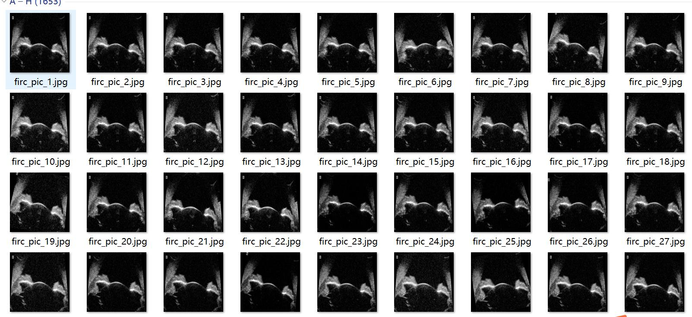
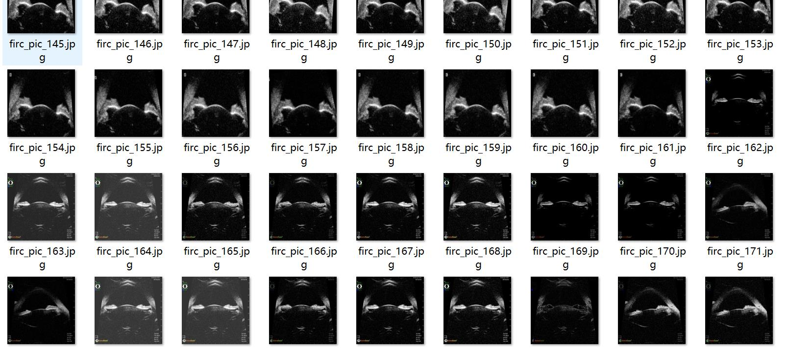
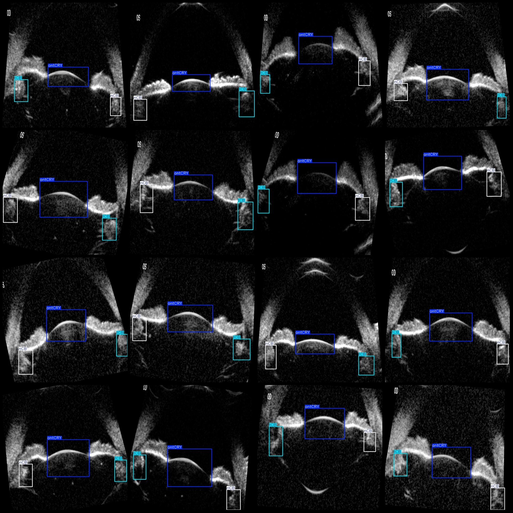
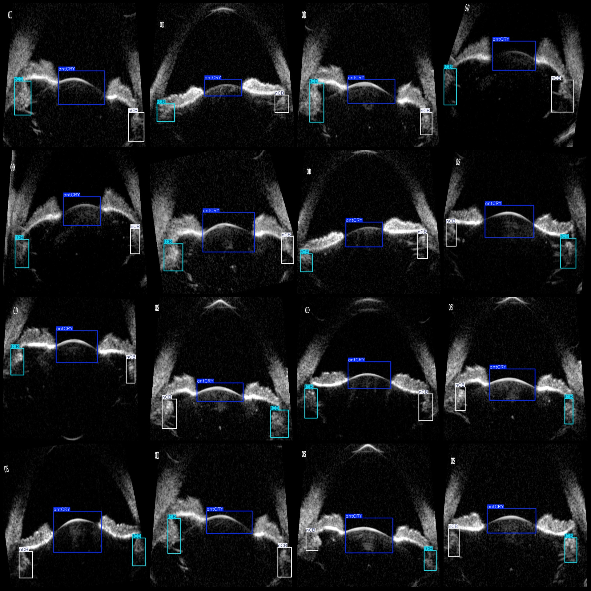

# Smart Medical Medical Imaging Dataset for Pre-Nasal Non-Cystic Solid Lesion Wall Thickness Inflammation Detection in Pascal VOC+YOLO Format with 1653 Images and 3 Categories

Dataset Format: Pascal VOC format + YOLO format (without split paths in txt files, only containing jpg images along with corresponding VOC format xml files and YOLO format txt files)

Number of Images (jpg File Count): 1653
Number of Annotations (xml File Count): 1653
Number of Annotations (txt File Count): 1653
Number of Annotation Categories: 3
Annotation Category Names (note that the order in the labels folder's classes.txt might differ from this, but is consistent with yolo format): ["antCRY", "nCB", "tCB"]

Number of Boxes per Category:
antCRY (Pre-nasal) Boxes = 1653
nCB (Non-cystic solid lesion) Boxes = 1654
tCB (Inflammatory thickening of the wall) Boxes = 1652
Total Boxes: 4959

Number of Images per Category:
antCRY (1653 images)
nCB (1652 images)
tCB (1651 images)

Image Resolution: 640x640

Annotation Tool Used: labelImg
Annotation Rules: Draw boxes around categories

Important Notice: The dataset does not have a division into training/validation/test sets; you will need to manually divide it.
Special Disclaimer: This dataset does not guarantee any accuracy in the trained models or weight files.

Image Preview:
Annotation Example:

## Images

Here is a pay link on Stripe ( https://buy.stripe.com/3cs8yP7sY87d0vu9AB ). Please contact me lonlonago@foxmail.com after funding $89, and I will send you a complete data files , thank you!

